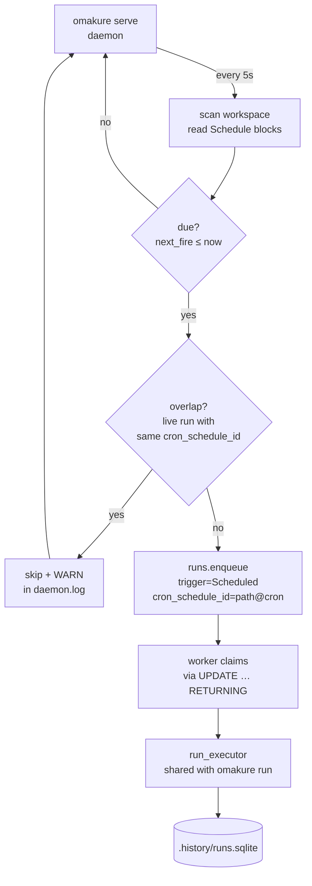

# Scheduling (`omakure serve`)

Omakure ships a per-workspace cron scheduler that turns any script with a
`Schedule` block into a self-contained automation unit. Scheduled fires
flow through the same queue, worker, and history pipeline as manual runs
— the only difference is `trigger = Scheduled`.

## Mental model



## Declaring a schedule

Add a `Schedule` block to the embedded JSON schema of any script (see
`how-to-create-a-script.md` for the full schema anatomy):

```json
"Schedule": {
  "Cron": "*/15 * * * *",
  "Enabled": true
}
```

Cron formats accepted (`src/domain/schedule.rs::normalize_cron_expr`):

| Form | Example | Meaning |
| --- | --- | --- |
| 5-field classic | `*/5 * * * *` | `min hour dom mon dow` |
| 6-field | `0 */5 * * * *` | seconds prefix |
| 7-field | `0 */5 * * * * 2026` | seconds + year |
| `@hourly` | — | top of every hour |
| `@daily` / `@midnight` | — | 00:00 every day |
| `@weekly` | — | Monday 00:00 |
| `@monthly` | — | day 1, 00:00 |
| `@yearly` / `@annually` | — | Jan 1, 00:00 |

`@reboot` is **rejected** — the scheduler has no startup semantics to
attach it to. Unknown macros and malformed expressions fail script load
with `error.code = "schema_invalid"`.

`Enabled` defaults to `true` when omitted. Toggle in place from the TUI
Schedules screen (`c` from the main menu, `Space` on the row).

## Running the scheduler

```bash
omakure serve                     # foreground; Ctrl+C stops
omakure serve -d                  # detached daemon (Unix only)
omakure serve --stop              # SIGTERM + 5s grace
omakure serve --no-worker         # scheduler only; workers run elsewhere
omakure serve --concurrency 4     # in-process worker pool size (default 1)
```

By default an in-process worker drains the queue so a single invocation
is end-to-end. Pair with `omakure queue worker` on another host/process
when you need cross-node workers.

## Lifecycle of one fire

Per tick (5 s), for each script with an enabled `Schedule`:

1. Parse the cron expression (cached by the schema loader).
2. Look up the last fire via `MAX(enqueued_at)` on `runs` filtered by
   `cron_schedule_id`. First-ever fire looks back **2 minutes** so
   sub-minute crons (e.g. `* * * * *`, `*/30 * * * * *`) are recognised
   as due on the first tick after daemon start.
3. `is_due = next_fire_after(last_fire_or_reference) ≤ now`.
4. **Overlap check** — if a prior row with the same `cron_schedule_id`
   is still `queued` or `running`, the fire is **skipped** and a `WARN`
   is logged. No exception, no stacking.
5. Build `--<arg> <default>` pairs from each field's declared `Default`.
   Fields without a default are silently omitted.
6. `runs::enqueue` with `trigger = Scheduled`, `actor = scheduler`,
   `reason = "cron: <expr>"`,
   `cron_schedule_id = <canonical_path>@<expr>`.
7. Worker picks the row up via the atomic `claim_next`; execution is
   identical to `omakure run` (60 s lease heartbeat, timeout, cancel,
   stdout/stderr draining).

## Observability

Per workspace:

- **PID file** — `<workspace>/.omaken/daemon.pid`. Created atomically via
  `OpenOptions::create_new`. On collision, a live PID returns
  `error.code = "daemon_already_running"`; a dead PID is silently
  reclaimed.
- **Log** — `<workspace>/.omaken/daemon.log`. Line-buffered; each line
  is `<RFC3339-UTC> [LEVEL] <message>`. Events include daemon
  start/stop, `tick fired=N`, `enqueued run_id=…`, `previous run still
  in flight, skipping fire`, and `invalid cron` parse errors.
- **History** — scheduled rows are first-class. Query with
  `omakure history list --state-set all` or filter by trigger in the
  TUI `History` screen.

Per scheduled row:

| Field | Value |
| --- | --- |
| `trigger` | `Scheduled` |
| `actor` | `scheduler` |
| `reason` | `cron: <expression>` |
| `cron_schedule_id` | `<absolute-canonical-script-path>@<cron-expression>` |

## Autostart (Linux / systemd)

`omakure serve --install` writes a systemd user unit that runs the
scheduler for the current workspace and survives reboots. The unit name
is derived from a stable 64-bit FNV-1a hash of the canonical workspace
path (`omakure-<hex>.service`), so multiple workspaces coexist without
collision.

```bash
omakure serve --install          # write unit, daemon-reload, enable --now
omakure serve --status           # {unit, unit_path, installed, active, enabled}
omakure serve --uninstall        # disable --now + delete unit + daemon-reload

# Tail the unit journal
journalctl --user -u <unit-name> -f
```

macOS and Windows currently return `error.code = "not_implemented"` for
these flags — wire the daemon up with your platform's service manager
(launchd, Task Scheduler) pointing at `omakure serve` in the target
workspace.

## Manual replay

To re-enqueue a row under an existing schedule id (e.g. for debugging a
past scheduled run):

```bash
omakure queue add my-script.bash \
  --cron-schedule-id "/abs/path/my-script.bash@*/15 * * * *"
```

The id is free-form provenance, so any string works. The scheduler
itself uses `<canonical-path>@<cron-expression>`; matching that format
keeps `omakure serve`'s overlap detection accurate.

## Failure modes

| Situation | Behaviour |
| --- | --- |
| Invalid cron on a script | Logged as `ERROR` each tick; other scripts keep firing; fix the expression to resume. |
| Script fails at runtime | Row finishes as `failed` via the shared executor; daemon continues. |
| Second `omakure serve` against the same workspace | Second invocation exits with `daemon_already_running`. |
| Stale PID file (process crashed) | Next start reclaims the file silently. |
| Worker crash | Orphan `running` rows are reclaimed once `lease_until` (60 s heartbeat) expires. |
| Required field has no `Default` | The fire still happens; the arg is omitted and the script's own body applies whatever defaults it defines. |

## Limitations

- Scan interval is hard-coded at 5 s (`SCAN_INTERVAL` in `src/cli/serve.rs`).
- `last_fire_at` is derived from `runs.enqueued_at`, not persisted in a
  dedicated table. Restarting the daemon within the first 2 minutes
  after a fire could theoretically re-enqueue a sub-minute cron; the
  overlap check prevents double-execution but a redundant skipped log
  line is possible in edge cases.
- `@reboot` is not supported.
- `serve --install`/`--uninstall`/`--status` are Linux-only (systemd
  user units).
- No per-schedule tunable (priority, timeout, actor override): all
  scheduled rows inherit `actor = scheduler` and no timeout. Override
  by producing the row manually via `queue add` and skipping the
  `Schedule` block, or wrap the script's own body with `timeout`.
