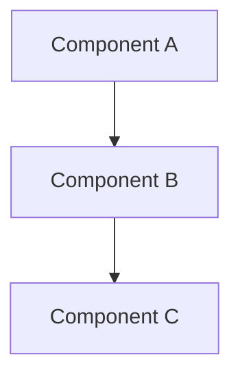

{Feature Name} - Plan

## Metadata
- **Based on Requirements:** {Link to requirements doc}

## Overview
{Brief description of the implementation approach}

## Architecture

### High-Level Design

{Describe the architectural approach}

### Design Patterns
- **Pattern 1:** {pattern-name} - {why it's used}
- **Pattern 2:** {pattern-name} - {why it's used}

### Technology Stack
- {Technology 1} - {version} - {purpose}
- {Technology 2} - {version} - {purpose}

## Implementation Phases

### Phase 1: {Phase Name}
**Goal:** {What this phase achieves}

**Tasks:**
- [ ] {Task 1}
- [ ] {Task 2}
- [ ] {Task 3}

**Deliverables:**
- {Deliverable 1}
- {Deliverable 2}

### Phase 2: {Phase Name}
**Goal:** {What this phase achieves}

**Tasks:**
- [ ] {Task 1}
- [ ] {Task 2}

**Deliverables:**
- {Deliverable 1}
- {Deliverable 2}

## Testing Strategy
- **Automated tests:** {Unit/integration/e2e coverage to add or update}
- **Manual validation:** {Manual scenarios and expected outcomes if automation is not available}
- **Regression validation:** {Existing flows to retest and why}

## Impact Analysis
- **Directly impacted areas:** {Modules/components/files}
- **Potential side effects:** {Behavior that can be affected}
- **Backward compatibility notes:** {Compatibility constraints and migration notes}

## Regression Risks and Mitigation
- **Risk 1:** {risk description}
  - **Mitigation:** {specific mitigation action}
- **Risk 2:** {risk description}
  - **Mitigation:** {specific mitigation action}

## Dependencies and Assumptions
- **Dependencies:** {External/internal dependencies}
- **Assumptions:** {Assumptions that influence implementation choices}

## Acceptance Criteria
- [ ] {Criterion 1}
- [ ] {Criterion 2}
- [ ] {Criterion 3}

## Traceability Matrix
- **{Criterion 1} ->** {Planned tasks} | **Validation:** {Test/verification approach}
- **{Criterion 2} ->** {Planned tasks} | **Validation:** {Test/verification approach}

## Success Metrics
- **{Metric 1}:** {Target value}
- **{Metric 2}:** {Target value}
- **{Metric 3}:** {Target value}
