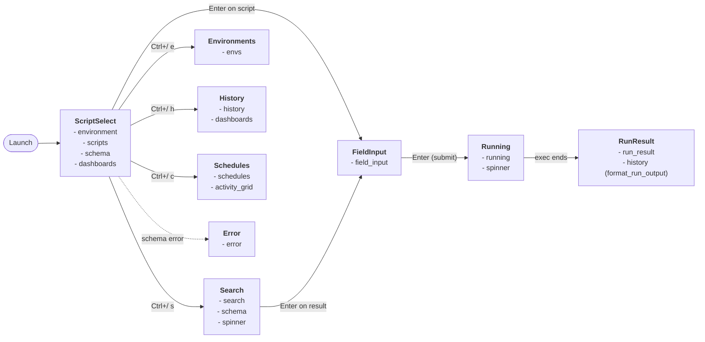

# TUI screens and widgets

Inventory of every screen and widget in the TUI layer. Use it to navigate the
code, plan refactors, or map user-visible behavior to its source.

Source locations:

| Layer | Path |
|-------|------|
| Screen dispatch | `src/adapters/tui/ui.rs` |
| App state & enum | `src/adapters/tui/app.rs` |
| Input handlers | `src/adapters/tui/events.rs` |
| Widgets | `src/adapters/tui/widgets/*.rs` |
| Per-screen state | `src/adapters/tui/state/*.rs` |

## Screen flow

`ScriptSelect` is the hub. Every other screen is reached from it; the
execution pipeline (`FieldInput → Running → RunResult`) is the one linear
chain.

### Navigation prefix

All cross-screen navigation uses a **tmux-style prefix key** (`Ctrl+/`).
Press `Ctrl+/` to enter prefix mode, then press the command key:

| Prefix + Key | Action |
|---|---|
| `Ctrl+/` then `s` | Open Search |
| `Ctrl+/` then `e` | Open Environments |
| `Ctrl+/` then `h` | Open History |
| `Ctrl+/` then `c` | Open Schedules |
| `Ctrl+/` then `q` | Quit |

When prefix mode is active, the footer shows `-- PREFIX --`. Any
unrecognized key cancels the prefix silently. `Esc` remains a direct
key for "go back" on every screen.

**Terminal compatibility:** `Ctrl+/` produces different key events
depending on the terminal emulator and keyboard layout. The handler
accepts all known variants:

| Terminal / layout | Key event received |
|---|---|
| Legacy xterm / VTE | ASCII `0x1F` (`Char('\x1f')`, no modifiers) |
| ABNT2 keyboards (where `/` shares the `7` key) | `Char('7')` + `CONTROL` |
| Kitty / enhanced keyboard protocol | `Char('/')` + `CONTROL` |

Return edges (not drawn to keep the diagram readable):

- `Search`, `History`, `Schedules`, `FieldInput`, `RunResult`, `Error` all return to `ScriptSelect` on `Esc`/`Enter`.
- `Environments` returns to whichever screen opened it (stored in `env_return`).
- `Running` has no user-driven exit; it transitions automatically to `RunResult` when the background run completes.
- From any screen, `Ctrl+/` then a command key navigates globally (see prefix table above).

## Widget inventory

| Widget | Purpose |
|---|---|
| `common` | Styling and layout helpers: state colors, status labels, standard header/body/footer layout, 50/50 horizontal split |
| `table_style` | Shared table/block styling helpers: bold header rows, bordered blocks with themed titles, selection symbol + style, standard column spacing |
| `spinner` | Animated Braille spinner glyphs (`Sand`, `Scan` kinds) |
| `loading` | Bootstrap loading screen shown before the `App` exists (spinner + "Loading environment...") |
| `environment` | Status banner at the top of ScriptSelect: Lua widget output, or fallback with root path, version, and repo URL |
| `scripts` | Scrollable workspace tree — directories suffixed with `/`, scripts as plain names, selection highlighted |
| `schema` | Schema preview panel — name, description, tags, fields (required/optional), outputs, matrix/cases |
| `search` | Search screen — query input with indexing status, result list, inline schema preview |
| `envs` | Environments screen — directory header, `.env` file list, scrollable preview of selected file |
| `field_input` | Parameter form — one input box per schema field, focused box highlighted |
| `history` | Runs table `[State \| Status \| Date \| Script \| Actor]` + scrollable output pane; hosts the Dashboards view |
| `dashboards` | Aggregated metrics — global state bar, top-6 scripts, per-script duration sparkline + p50/p95 |
| `activity_grid` | Run-outcome heatmap grid with selectable period (LastMinute, LastHour, Day, Week, Month, Year). Past runs colored by outcome (green/red/yellow/magenta); upcoming scheduled runs overlaid in cyan on empty cells (Day/Week/Month/Year only) |
| `schedules` | Scheduled scripts table (`[Script \| Cron \| On]`) + per-script activity grid + next-run timestamp |
| `running` | "Running script..." modal with spinner, script name, and args |
| `run_result` | Last-run output — status badge, script name, full scrollable stdout/stderr |
| `error` | Fatal-error modal with red message body and help footer |

## Screen inventory

| Screen | Purpose | Previous screen | Next screen | Available commands |
|---|---|---|---|---|
| **ScriptSelect** | Hub — workspace tree, schema preview, per-script charts, env status badge (bottom-right) | any (hub): History, RunResult, Schedules, Environments, Search, FieldInput, Error, Running (auto) | Search, Environments, History, Schedules, FieldInput, Error, Running | `Up`/`Down`/`k`/`j` move selection · `Enter` open dir or run script · `Backspace`/`Left` navigate up · `Tab` cycle activity period · `e` toggle per-script dashboard expand · `PageUp`/`PageDown` scroll schema preview when capped · `r`/`R`/`F5` refresh entries · `i`/`I`/`F6` refresh status · `Esc` collapse → up → quit · **Prefix** `Ctrl+/` then `s`/`e`/`h`/`c`/`q` |
| **Search** | Full-text search across all scripts in the workspace | ScriptSelect (via prefix) | ScriptSelect, Environments, FieldInput, Error | any printable char append to query · `Backspace` pop char · `Up`/`Down`/`k`/`j` move result selection · `Enter` open selected result · `Esc` back · **Prefix** `Ctrl+/` then `s`/`e`/`h`/`c`/`q` |
| **Environments** | Select / activate / preview `.env` files for the workspace | any screen (via prefix, stored in `env_return`) | returns to `env_return` | `Up`/`Down`/`k`/`j` move file selection · `PageUp`/`PageDown` scroll preview ±10 · `Home`/`End` preview top/bottom · `Enter` activate selected env · `d`/`D` deactivate env · `r`/`R` refresh · `Esc` back · **Prefix** `Ctrl+/` then `s`/`e`/`h`/`c`/`q` |
| **FieldInput** | Collect schema field values before execution | ScriptSelect (Enter on script), Search (Enter on result) | Running, ScriptSelect | `Tab`/`Down` next field · `Shift+Tab`/`Up` previous field · any printable char append to field · `Backspace` delete char · `Enter` submit · `Esc`/`Ctrl+B` back · **Prefix** `Ctrl+/` then `s`/`e`/`h`/`c`/`q` |
| **History** | Browse past runs; toggle detailed list ↔ aggregated dashboards | ScriptSelect (via prefix) | ScriptSelect, Environments | `Tab` toggle view · `Esc` back · **List + List focus:** `Up`/`Down`/`k`/`j` row · `Enter`/`Right` focus output · **List + Output focus:** `Up`/`Down`/`k`/`j` scroll ±1 · `PageUp`/`PageDown` scroll ±10 · `Home`/`End` bounds · `Esc`/`Left`/`Backspace` back to list · **Dashboards:** `Up`/`Down`/`k`/`j` select script · `e`/`E`/`Enter` toggle expand · `Esc` collapse → back · **Prefix** `Ctrl+/` then `s`/`e`/`h`/`c`/`q` |
| **Running** | "Please wait" modal while the script executes in the background | FieldInput | RunResult (automatic when `inline_run_receiver` delivers the result) | none (no input; exits automatically when exec ends) |
| **RunResult** | Show output of the most recent run | Running (automatic) | ScriptSelect | `Up`/`Down`/`k`/`j` scroll ±1 · `PageUp`/`PageDown` scroll ±10 · `Home` top · `Esc`/`Enter` back · **Prefix** `Ctrl+/` then `s`/`e`/`h`/`c`/`q` |
| **Error** | Fatal-error modal (typically schema parse failure) | ScriptSelect, Search (via `load_schema` failure) | ScriptSelect, quit | `Enter` clear error + back to ScriptSelect · `Esc` quit |
| **Schedules** | List cron-scheduled scripts; toggle enabled; inspect per-script history | ScriptSelect (via prefix) | ScriptSelect | `Up`/`Down`/`k`/`j` move selection · `Space` toggle enabled/disabled · `Tab` cycle activity period · `r`/`R`/`F5` refresh · `Esc` back · **Prefix** `Ctrl+/` then `s`/`e`/`h`/`c`/`q` |

## Per-screen state

| Module | Field on `App` | Holds |
|---|---|---|
| `state/navigation.rs` | `app.navigation` | `entries`, `list_state`, `current_dir`, `schema_preview`, `schema_preview_scroll`, `widget` (Lua), `widget_loading`, `widget_error` |
| `state/search.rs` | `app.search` | `query`, `status`, `results`, `selection`, `details` |
| `state/environment.rs` | `app.environment` | `entries`, `config`, `selection`, `preview_lines`, `preview_scroll`, `preview_error` |
| `state/field_input.rs` | `app.field_input` | `selected_script`, `schema_name`, `schema_description`, `fields`, `field_inputs`, `field_index`, `error` |
| `state/history.rs` | `app.history` | `entries`, `selection`, `view`, `focus`, `dashboard_layout` |

Global fields in `app.rs`: `screen`, `tick`, `activity_period`,
`script_dashboard_expanded`, `run_output_scroll`, `error_message`,
`env_return`, `inline_run_receiver`, `schedules`, etc.
