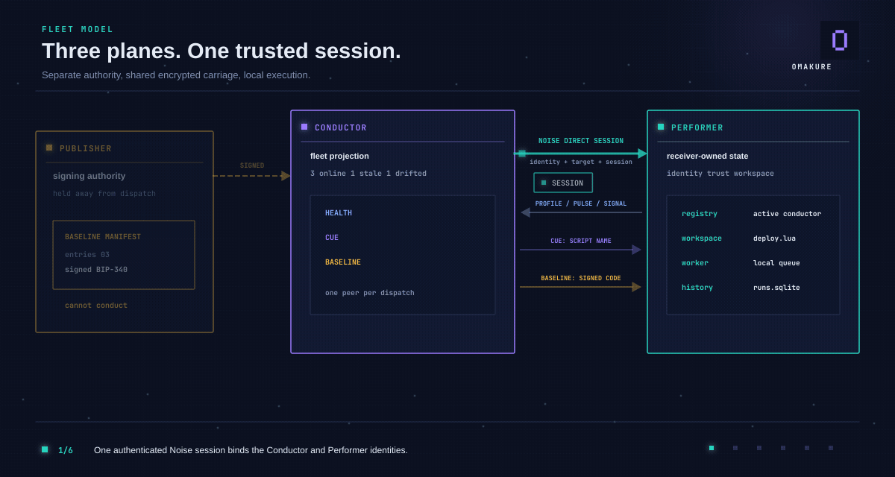
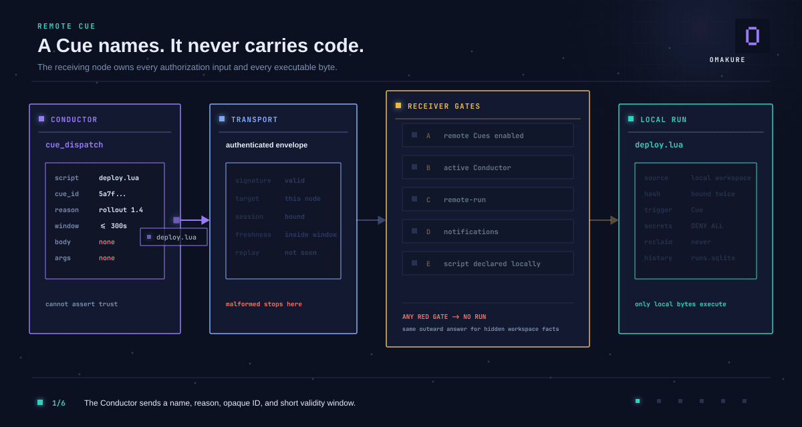

<p align="center">
  
</p>

> ### *Scripts, nodes... and control.*

Omakure is a headless automation runner with authenticated node-to-node
coordination. It runs ordinary Bash, PowerShell, Python, and embedded Lua
scripts, then keeps queue state, run history, and structured traces in local
SQLite. The machine-owned `omakure node serve` process combines the management
API, optional workers, the scheduler, identity, trust, and direct transport.

It is deliberately smaller than an MDM. Omakure provides the execution and
trust layer; each organization still decides what its operations actually do.

## Three planes, one trusted session



One authenticated direct session carries three separate application planes:

| Plane | Direction | Responsibility |
|---|---|---|
| **Health** | Performer to Conductor | Reports bounded current facts, liveness, run outcomes, and Baseline state. |
| **Cue** | Conductor to Performer | Names one script the receiving node already declared as remotely runnable. |
| **Baseline** | Publisher through Conductor to Performer | Delivers a signed, versioned script set under two independent authorities. |

The planes share transport but not authority. A Conductor may ask. A Publisher
may sign code. A Performer decides which peers, publishers, and scripts it
accepts. [Read the fleet model](docs/fleet-model.md).

## A Cue names. It never carries code.



A Cue contains no script body, arguments, environment, secret, or working
directory. The receiver verifies the session, reads trust and capabilities from
its own registry, resolves its own allow-list, binds the authorized content hash,
and executes the local bytes at most once. A script with secret-bearing fields is
refused before it becomes a run.

The immediate acknowledgement and eventual `run-completed` Signal are separate,
so dispatch remains bounded while the outcome stays correlated by run ID. See
[Remote Cues](docs/usage.md#remote-cues) and the
[implemented contract](docs/internal/remote-cue-contract.md).

## What ships today

| Area | Current behavior |
|---|---|
| Scripts | `.bash`, `.sh`, `.ps1`, `.py`, and `.lua`; Lua 5.4 is embedded. |
| Execution | Direct runs, local SQLite queue workers, cron scheduling, cancellation, timeout, redaction, history, and traces. |
| Interfaces | Machine-readable CLI, stable JSON envelope, and authenticated HTTP management API over shared operations. |
| Nodes | Persistent machine identity, explicit trust and capabilities, revocation, LAN discovery, manual enrollment, and signed-bundle enrollment. |
| Transport | Authenticated encrypted direct sessions with replay limits and redacted audit outcomes. |
| Fleet | Current Health projection, authorized Remote Cues, signed Baseline delivery, drift detection, and verified local rollback. |
| Batteries | External script repositories that remain untrusted until a local install validates and copies a selected script. |

Release and CI targets cover x86_64 Linux, macOS, and Windows. Linux also runs
bounded multi-container transport and Health certification gates. Platform
installer evidence is stated separately in [Installation](docs/installation.md)
rather than inferred from a successful build.

## Boundaries, on purpose

- The run queue and detailed history are local SQLite state, not a distributed
  queue or shared multi-host database.
- Cue and Baseline dispatch target one peer at a time. Campaigns and fan-out are
  not implemented.
- Nostr transport is not implemented; the shipped node-to-node path is direct.
- Omakure is not an MDM today. It does not provide device wipe, package
  inventory, compliance scoring, configuration enforcement, or unattended
  provisioning.
- The official machine service runs as a restricted service account. Omakure
  does not provide a privilege broker or built-in administrative elevation.
- Remote Cues cannot introduce code or consume Omakure-managed secrets.

These are product boundaries, not hidden roadmap claims. The exact privacy,
authorization, retention, and size limits live in the implemented contracts
under [`docs/internal/`](docs/internal/).

## Quick start

Requirements for development are Rust, Git, Bash, and `jq`.

- Optional PowerShell (`pwsh`) runs `.ps1` scripts.
- Optional Python 3 runs `.py` scripts.
- Lua needs no system interpreter because Lua 5.4 is embedded.

Build this checkout and inspect the machine surface:

```bash
cargo build
cargo test --locked
cargo run --bin omakure -- --help
cargo run --bin omakure -- help-ai
```

Create and run a local script:

```bash
cargo run --bin omakure -- init hello.lua \
  --schema-json '{"Name":"hello","Fields":[]}' \
  --body-stdin <<'LUA'
print("hello from " .. _VERSION)
LUA

cargo run --bin omakure -- --json run hello.lua --actor local --reason smoke-test
cargo run --bin omakure -- --json history list --limit 5
```

After installing a release, use `omakure doctor` to verify the workspace,
required tools, optional runtimes, and every discovered script schema.

Install the latest tagged release on Linux or macOS:

```bash
curl -fsSL https://raw.githubusercontent.com/This-Is-NPC/omakure/main/install.sh \
  | bash -s -- --repo This-Is-NPC/omakure
```

Start with [CLI and HTTP usage](docs/usage.md) for local and multi-node
workflows. Use [Deployment](docs/deployment.md) before exposing a node service.

## Documentation

- [Documentation map](docs/README.md)
- [Fleet model](docs/fleet-model.md)
- [CLI and HTTP usage](docs/usage.md)
- [Installation and machine services](docs/installation.md)
- [Deployment and security checklist](docs/deployment.md)
- [Batteries](docs/batteries.md)
- [Script authoring](docs/how-to-create-a-script.md)
- [Architecture](docs/internal/architecture.md)
- [Implemented requirements](docs/internal/requirements.md)

## Validation

```bash
cargo test --all-targets --locked
cargo clippy --all-targets --locked -- -D warnings
cargo fmt --check
```

The release archive contains only `omakure` or `omakure.exe`. Documentation
assets and their editable sources stay in the repository, never in the runtime
package.

## License

Omakure is available under the [MIT License](LICENSE).
