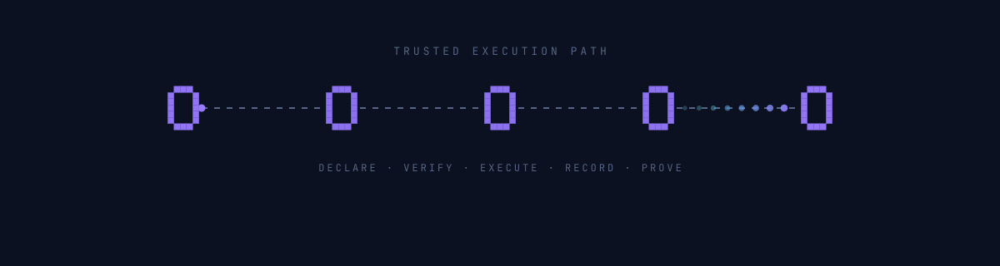

<p align="center">
  
</p>

> ### *Scripts, nodes... and control.*

Omakure is a self-hosted headless automation runner with a local CLI,
authenticated HTTP management API, and optional machine-owned peer-to-peer
fleet layer. It distributes approved automation, collects bounded status, and
audits executions across Linux, macOS, and Windows.

## Start here

Read the **[documentation hub](docs/README.md)** for the recommended path by
audience. New users should begin with the [local usage guide](docs/usage.md);
operators should use the [fleet operations manual](docs/fleet-operations.md).

## Operating model

Nodes connect directly over authenticated, encrypted sessions. There is no
fixed coordination server. Each trust relationship defines what a peer may
request or report.

| Surface | Purpose |
|---|---|
| **Local CLI** | Discover approved scripts, run them directly or through the local queue, and inspect history. |
| **HTTP API** | Provide authenticated management access to the same operations for trusted local tools and services. |
| **Node service** | Hold direct peer sessions and handle fleet health, enrollment, Remote Cues, and Baseline delivery. |

A node may manage some peers while being managed by another. Roles belong to
trust records, not permanently to machines.

## Current capability boundary

- Run schema-bearing Bash, PowerShell, Python, or embedded Lua scripts with
  consistent timeouts, cancellation, redaction, history, and traces.
- Enroll and explicitly trust peers, discover nodes on a local network, report
  current fleet health, and request approved Remote Cues one peer at a time.
- Deliver signed, versioned Baselines atomically, detect local drift, and
  perform a verified local rollback.
- Expose human-readable CLI and stable JSON surfaces, an authenticated HTTP
  API, and the machine-owned `node serve` process.
- Register, sync, inspect, validate, and locally install scripts from external
  Battery repositories on Unix systems.

Remote requests name scripts a Performer already has; they do not carry source
code, arguments, environment values, or secrets. Baselines are the separate,
signed path for changing installed automation. Detailed protocol rules and
bounds live in the [fleet operations manual](docs/fleet-operations.md) and
[Protocol contracts](docs/README.md#protocol-contracts).

## First local run

Development requires Rust, Git, Bash, and `jq`. Optional PowerShell or Python
is needed only by scripts using those runtimes; Lua 5.4 is embedded in Omakure.

```bash
cargo build
cargo run --bin omakure -- --help
cargo run --bin omakure -- help-ai
cargo run --bin omakure -- doctor
```

For local runs, queues, environments, and Battery quickstarts, continue with
the [usage guide](docs/usage.md). To install a tagged release, see
[Installation](docs/installation.md).

## More documentation

- [Fleet model](docs/fleet-model.md): conceptual roles and the three protocol planes.
- [Deployment](docs/deployment.md): trusted-internal API and node-service operation.
- [Batteries](docs/batteries.md): external automation repositories and local installation.
- [Script authoring](docs/how-to-create-a-script.md): schemas and supported runtimes.

## License

Omakure is available under the [MIT License](LICENSE).
