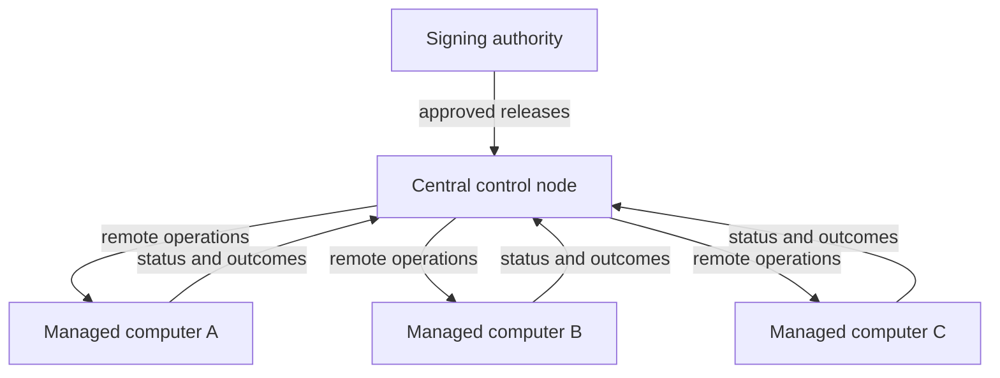
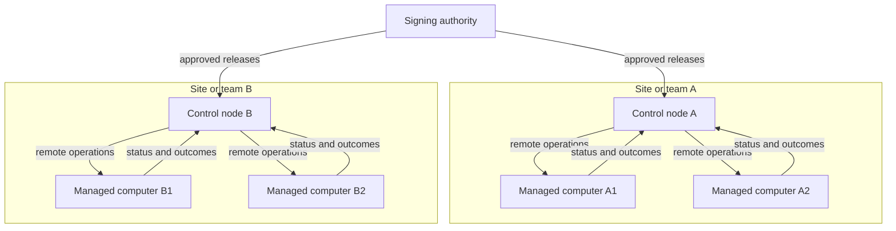
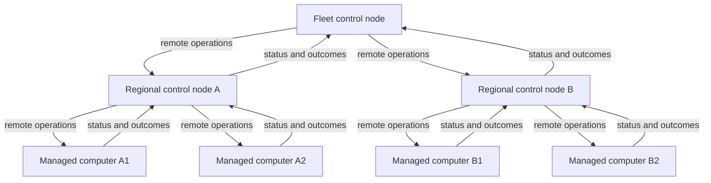

<p align="center">
  
</p>

> ### *Scripts, nodes... and control.*

Omakure is a self-hosted remote operations layer for managing a fleet of
computers over a secure peer-to-peer mesh.

Distribute approved automation, run remote maintenance, monitor operational
status, and audit executions across Linux, macOS, and Windows.

## How it works

Computers connect directly over authenticated, encrypted sessions. No fixed
coordination server is required, and every relationship defines what each peer
is allowed to request or report.

The protocol gives each participant a clear responsibility:

| Role | Protocol term | Responsibility |
|---|---|---|
| **Control node** | Conductor | Monitors managed computers, requests approved operations, and delivers signed automation releases. |
| **Managed computer** | Performer | Reports current status, validates incoming requests, and runs local automation. |
| **Signing authority** | Publisher | Signs the exact automation files approved for distribution. |

A computer can control some peers while being managed by another. Its role is
defined by each trust relationship, not permanently assigned to the machine.


One authenticated session supports three independent workflows:

| Workflow | Protocol name | Purpose |
|---|---|---|
| **Fleet status** | Health | Reports liveness, runtime availability, recent outcomes, and the state of installed automation. |
| **Remote operation** | Cue | Requests an operation the managed computer already has and has explicitly approved. |
| **Signed automation delivery** | Baseline | Installs a signed, versioned set of automation files as one atomic release. |

## Remote operations run approved code


A remote request identifies an operation by name. It does not contain source
code, arguments, environment values, secrets, or a working directory. The
managed computer checks its own permissions and allow-list, binds the request to
the exact local file, executes it at most once, and returns a bounded outcome.

New automation follows a separate path. A signed automation release is verified
and installed as a complete set, while a local operator can inspect and install
selected scripts from an automation repository. Software delivery and execution
remain separate operations.

## Built around scripts

Operations are ordinary Bash, PowerShell, Python, or embedded Lua scripts. Each
script can declare typed inputs, outputs, tags, secrets, and an optional cron
schedule through an embedded JSON schema.

The same execution path serves direct runs, local queues, schedules, the HTTP
API, and approved remote requests. Timeouts, cancellation, redaction, history,
and structured traces behave consistently across every entry point.

## Available today

| Area | Capabilities |
|---|---|
| **Fleet coordination** | Persistent machine identity, explicit trust, enrollment, revocation, LAN discovery, current status, and remote operations. |
| **Automation delivery** | Signed versioned releases, atomic installation, drift detection, and verified local rollback. |
| **Execution** | Direct runs, SQLite queues, concurrent workers, cron scheduling, cancellation, timeouts, redaction, history, and traces. |
| **Interfaces** | Human-readable CLI, stable JSON responses, authenticated HTTP API, and the machine-owned `node serve` process. |
| **Automation repositories** | Register, sync, inspect, validate, and locally install selected scripts with provenance on Unix systems. |
| **Platforms** | Build and release targets for Linux, macOS, and Windows, with native platform adapters and scripts for host-specific operations. |

This supports software updates, VPN and certificate maintenance, backups,
configuration changes, diagnostics, scheduled maintenance, and other operations
defined by the scripts your organization approves.

Specialized operations such as lock, wipe, recovery, or host checks are also
organization-owned scripts, not separate Omakure features. They can be maintained
in a private automation repository and distributed through signed releases.

The authenticated HTTP API also allows teams to build their own web, desktop,
CI, or agent-driven control surfaces without coupling them to the runtime.

## Security model

Omakure answers four operational questions:

- Which machine is this?
- Which peer may request an operation?
- Which exact script is approved to run?
- What happened when it ran?

Authorization belongs to the receiving computer. An encrypted connection proves
who is connected, but it does not grant permission by itself. Trust, capabilities,
approved scripts, signing authorities, and revocations are read from local state
before an operation is accepted.

Detailed output, traces, environment values, workspace paths, and secrets remain
on the computer that ran the operation. Fleet status and completion reports carry
only bounded operational data.

> Omakure audits operations, not people.

## Deployment patterns

Omakure does not require a single topology. The same computer can be managed by
one peer while controlling others. Every connection remains direct and keeps its
own trust and permissions.

### One central control node

A single control node can operate a small or medium fleet. A separate signing
authority approves the automation distributed through it.



### Multiple control nodes

Larger fleets can be split by team, site, network, or responsibility. Each
control node manages its own computers, while the same signing authority can
approve automation for every group.



### Layered mesh

A computer can report to an upstream control node and manage its own downstream
group at the same time. This supports regional, site, or edge control without
changing the protocol.



Each level sees and operates its directly trusted peers. Operations, status, and
queues are not forwarded implicitly between levels.

## Roadmap

These are future directions, not current capabilities:

- **Omakure Control:** organizations, groups of computers, fleet-wide campaigns,
  access control, and a dedicated operations console.
- **Provisioned systems:** ISO images that boot as managed computers, generate
  their own identity, and enter the enrollment flow.
- **Windows automation repositories:** install approved scripts from automation
  repositories (Batteries) on Windows with the same validation, provenance, and
  safe replacement guarantees available on Unix.
- **Identity integration:** OIDC for the control console and optional integration
  with machine login flows.

## Quick start

Development requires Rust, Git, Bash, and `jq`. PowerShell and Python are needed
only for scripts using those runtimes; Lua 5.4 is embedded in Omakure.

Build the project and inspect the command surface:

```bash
cargo build
cargo test --locked
cargo run --bin omakure -- --help
cargo run --bin omakure -- help-ai
```

Create and run a local operation:

```bash
cargo run --bin omakure -- init hello.lua \
  --schema-json '{"Name":"hello","Fields":[]}' \
  --body-stdin <<'LUA'
print("hello from " .. _VERSION)
LUA

cargo run --bin omakure -- --json run hello.lua --actor local --reason smoke-test
cargo run --bin omakure -- --json history list --limit 5
```

Install the latest tagged release on Linux or macOS:

```bash
curl -fsSL https://raw.githubusercontent.com/This-Is-NPC/omakure/main/install.sh \
  | bash -s -- --repo This-Is-NPC/omakure
```

After installation, run `omakure doctor` to verify the workspace, required
tools, optional runtimes, and discovered script schemas.

## Documentation

- [Fleet model](docs/fleet-model.md)
- [CLI and HTTP usage](docs/usage.md)
- [Installation and machine services](docs/installation.md)
- [Deployment and security](docs/deployment.md)
- [Automation repositories](docs/batteries.md)
- [Script authoring](docs/how-to-create-a-script.md)
- [Architecture](docs/internal/architecture.md)
- [Complete documentation map](docs/README.md)

## Validation

```bash
cargo test --all-targets --locked
cargo clippy --all-targets --locked -- -D warnings
cargo fmt --check
```

## License

Omakure is available under the [MIT License](LICENSE).
