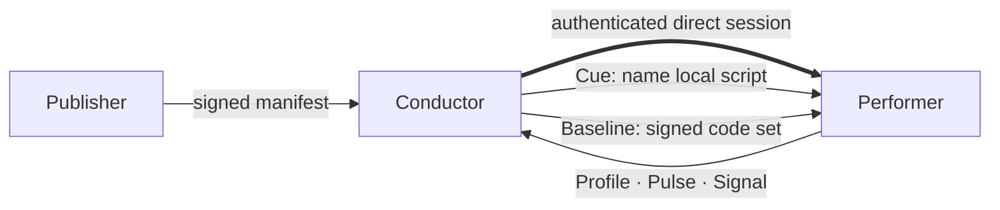
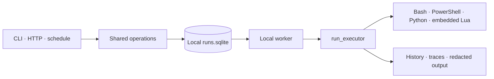

# Fleet model

Omakure coordinates machines without turning one database into a distributed
control plane. Each node keeps its own identity, trust registry, workspace, run
queue, and detailed history. Authenticated direct sessions carry a small set of
bounded messages between nodes.

## The cast

| Role | Responsibility | Power it does not receive |
|---|---|---|
| **Publisher** | Signs a versioned Baseline manifest over exact script bytes. | Cannot conduct a Performer from the same node. |
| **Conductor** | Observes trusted Performers, delivers signed Baselines, and asks for declared scripts to run. | Cannot sign arbitrary code as an accepted Publisher. |
| **Performer** | Reports current facts, verifies incoming work, installs accepted Baselines, and executes local scripts. | Does not accept a role, capability, or allow-list asserted by a message. |

A role belongs to one trust relationship, not permanently to a machine. A node
can conduct some peers while performing for another, subject to the registry's
conflict rules.

## One session, three planes

The direct Noise session authenticates the peer and protects carriage. It does
not grant application authority by itself. Each plane performs its own checks
against receiver-owned state.

| Plane | What crosses the wire | Receiver-owned decision |
|---|---|---|
| **Health** | Closed Profile, Pulse, Signal, acknowledgement, and error schemas. | Role, capability, target, signature, ordering, rate, and privacy bounds. |
| **Cue** | Script name, opaque Cue ID, reason, and validity window. | Remote execution enabled, active Conductor, capabilities, local declaration, schema, and content hash. |
| **Baseline** | Signed manifest and the exact script bodies it binds. | Active Conductor with `baseline-push`, accepted Publisher, signature, organization, lifetime, paths, and hashes. |

## A local execution remains local

Remote coordination ends at the same executor used by direct, queued, and
scheduled work. Detailed output, traces, environment values, workspace paths,
and secrets remain local. A `run-completed` Signal reports only the bounded
outcome needed by the Conductor.

## Cue and Baseline are intentionally different

A Cue selects code already present on the Performer. It never carries code,
arguments, environment, secrets, or execution parameters. Cue-origin runs use a
deny-all Omakure secret policy and bind the script hash at authorization and
again at execution.

A Baseline carries code, so it requires two independent authorities. The
Conductor proves who is asking to deliver; the Publisher signature proves what
bytes may land. Installation is all-or-nothing, and the node retains one
previous version for locally initiated, re-verified rollback.

Batteries solve a different problem. They are external script repositories that
a local operator may sync, inspect, and selectively install. Installation is a
Unix-only local act that may be initiated by the CLI or an authenticated HTTP
operator, but a remote peer or Remote Cue cannot install a Battery.

## Health is a projection, not a verdict

The Performer reports bounded current facts. The Conductor derives presence and
Baseline state from those facts. Health has no arbitrary fields, raw logs,
installed-package inventory, disk-encryption state, CPU or memory gauges,
screenshots, or long-term time series.

The public projection answers current questions such as which trusted peers are
online, which runtimes they report, and whether their recorded Baseline matches
the observed bytes. It is not a compliance engine.

## Current boundaries

- Direct transport is implemented; Nostr transport is not.
- Cue and Baseline dispatch address one peer at a time; campaigns and fan-out
  are not implemented.
- Queue and detailed history storage are local SQLite, not a distributed queue.
- Health stores a bounded latest-state projection, not long-term telemetry.
- Omakure has no built-in privilege broker or administrative elevation.
- MDM features such as device wipe, package inventory, compliance scoring,
  configuration enforcement, and unattended provisioning are not implemented.

## Normative contracts

- [Direct transport and enrollment](internal/direct-transport-contract.md)
- [Health Plane](internal/health-plane-contract.md)
- [Remote Cues](internal/remote-cue-contract.md)
- [Baseline delivery](internal/baseline-delivery.md)

The contracts own exact bytes, authorization order, refusal codes, rates,
retention, and size bounds. This document is the conceptual map, not a second
protocol specification.
